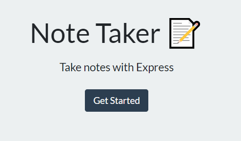
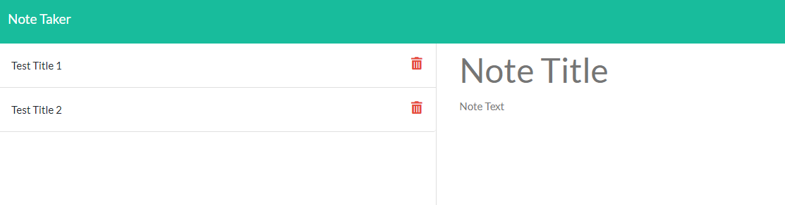

# 11_NoteTaker

## Task

Your assignment is to modify starter code to create an application called Note Taker that can be used to write and save notes. This application will use an Express.js back end and will save and retrieve note data from a JSON file.

The application’s front end has already been created. It's your job to build the back end, connect the two, and then deploy the entire application to Heroku.

## User Story

```
AS A small business owner
I WANT to be able to write and save notes
SO THAT I can organize my thoughts and keep track of tasks I need to complete
```

## Acceptance Criteria

```
GIVEN a note-taking application
WHEN I open the Note Taker
THEN I am presented with a landing page with a link to a notes page
WHEN I click on the link to the notes page
THEN I am presented with a page with existing notes listed in the left-hand column, plus empty fields to enter a new note title and the note’s text in the right-hand column
WHEN I enter a new note title and the note’s text
THEN a Save icon appears in the navigation at the top of the page
WHEN I click on the Save icon
THEN the new note I have entered is saved and appears in the left-hand column with the other existing notes
WHEN I click on an existing note in the list in the left-hand column
THEN that note appears in the right-hand column
WHEN I click on the Write icon in the navigation at the top of the page
THEN I am presented with empty fields to enter a new note title and the note’s text in the right-hand column
```

## Table of Contents

If your README is long, add a table of contents to make it easy for users to find what they need.

- [Links to Application](#Links)
- [Mock-Up](#Mock-Up)
- [Install](#installation)
- [Usage](#usage)
- [Credits](#credits)
- [Test](#test)
- [Questions](#questions)

## Links

Below are links to access this live website and repository.

Github: https://github.com/bergannation/11_NoteTaker

Deployed URL (Heroku): https://bergan-notetaker2.herokuapp.com/

## Mock-Up

The following gif shows the web application's appearance and functionality:


## Installation

The note taker application allows for users to write, save and delete two notes organized with a note title and text area. The application was created using express.js to retrieve the user input data.

The site features:

Express.js
Node.js
Heroku (used for site Deployment)

The user will be required to use the Express package via NodeJS & NPM commands. The user will input the following in their command line to install the neccessary packages:

```bash
npm init -y
npm i express
```

## Usage

The user will begin the process by invoking the application in NodeJS. The application will be invoked by using the following command:

```bash
node server.js
```

From there, click on the "Get Started" Button which will direct you to the /notes page allowing you to input pertinent information for the Note Title and Text Area.



Users can save, delete, and add new notes from this menu.



## Tests

Testing: No testing was needed for this application

## Questions

Here is a link to my github for more information: [Github]: https://github.com/BerganNation

You can reach me with any additional questions by email: BerganNation@gmail.com
